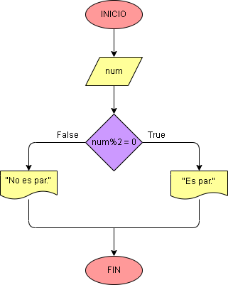

# Ejercicio No. 10: Número par.

Para llevar esto a cabo necesitaremos la ayuda del operador módulo (%).
Para determinar si un número es par, podemos utilizar el operador módulo para verificar si el resto de la división por 2 es igual a 0.
Si el resto de la división es igual a 0, entonces el número es par, de lo contrario, el número no es par. 

