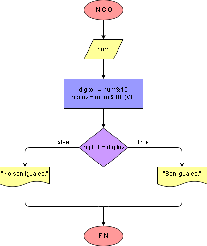

# Ejercicio No. 11: ¿Los últimos dos dígitos son iguales?

En este caso, el operador módulo se puede usar para encontrar los últimos dos dígitos del número ingresado. Después de almacenar los últimos dos dígitos, el programa compara los dos dígitos encontrados y determina si son iguales o no.

