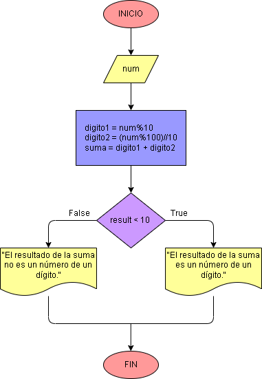

# Ejercicio No. 12: ¿La suma de los últimos dos dígitos da un número de un dígito?

Para la construcción de este programa se retomará la misma estructura del ejercicio anterior para poder almacenar los últimos dos dígitos de un número, la diferencia está en que en el processing se sumarán los números almacenados en las variables y se imprimirá una respuesta positiva si se cumple la condición o una negativa de lo contrario.

