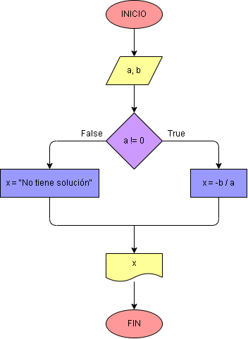

# Ejercicio No. 13: Ecuación de primer grado.

Los conceptos que se deben tener claros para la correcta realización de este programa son los siguientes:	

* Una ecuación de primer grado se ve representada de la forma ax + b = 0 ; para la resolución de esta se despeja la x quedando una ecuación como esta x = -b/a
* Es importante comprender que a debe ser diferente de cero, ya que no se puede dividir entre cero.

Teniendo claros estos conceptos, se procede con la realización del código. El programa inicia imprimiendo en la consola la estructura con la que se trabajarán las variables a y b seguido con la solicitud de éstas. La variable x tiene la función de almacenar el resultado de la ecuación cuando a sea diferente de 0, y cuando no, tiene la función de almacenar la frase "No tiene solución”. Y, por último, se invocará la función print para poder evidenciar el resultado en pantalla.

