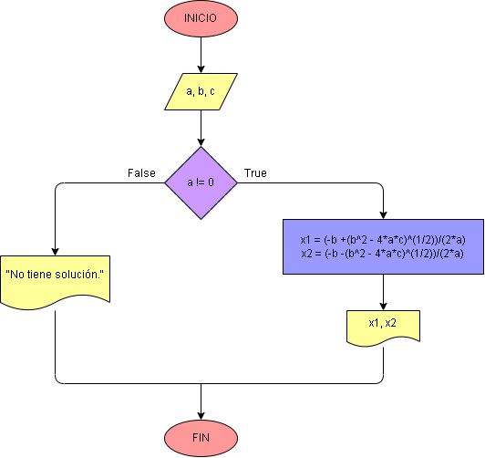

# Ejercicio No. 14: Ecuación de segundo grado.

Se deben tener presentes algunos conceptos sobre ecuaciones de segundo grado:

Una ecuación de segundo grado se ve representada de la forma ax^2  + bx + c = 0 ; Para resolver una ecuación de segundo grado, se necesita usar la fórmula general de la ecuación cuadrática, donde:

* x1 = (-b + (b^2 - 4*a*c)^(1/2)) / (2*a)
* x2 = (-b - (b^2 - 4*a*c)^(1/2)) / (2*a)
* El valor de a no puede ser 0.

Teniendo en cuenta estos conceptos, se le solicita al usuario que ingrese los valores de a,b y c; y con condicionales se logra hacer el procesamiento para al final conocer el o los resultados de nuestra ecuación.

