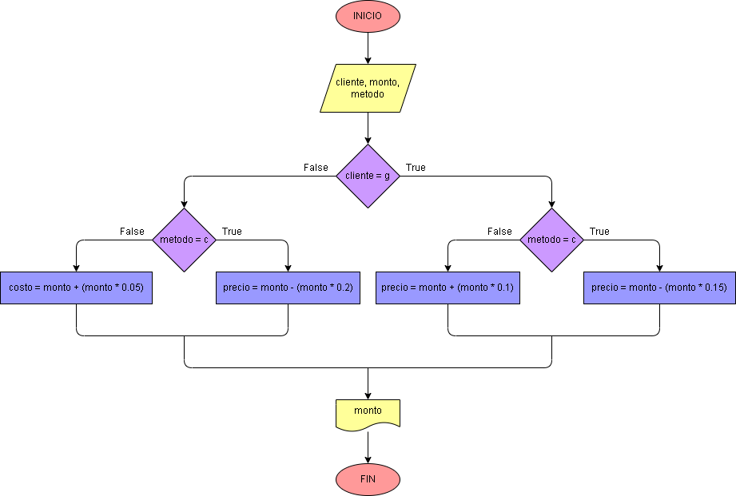

# Ejercicio No. 15: Problema de un negocio.

se tiene que calcular el precio final que tendrá el cliente al comprar un producto. Para ello se pide el tipo de cliente, si es general o afiliado, y el tipo de pago, si es al contado o en plazos. Según lo que inserten, se procede a calcular el precio final.

