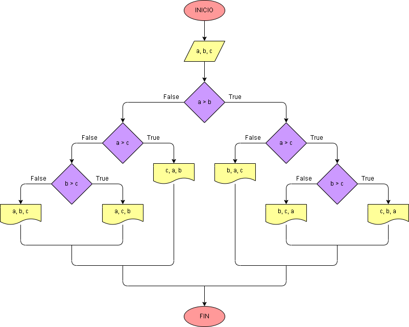

# Ejercicio 16: Organizar tres números en orden ascendente.

El primer paso es solicitar al usuario que ingrese tres números enteros y, luego, usando los operadores de comparación, se comparan todas las posibilidades y se imprime la forma ascendente de los tres números.

