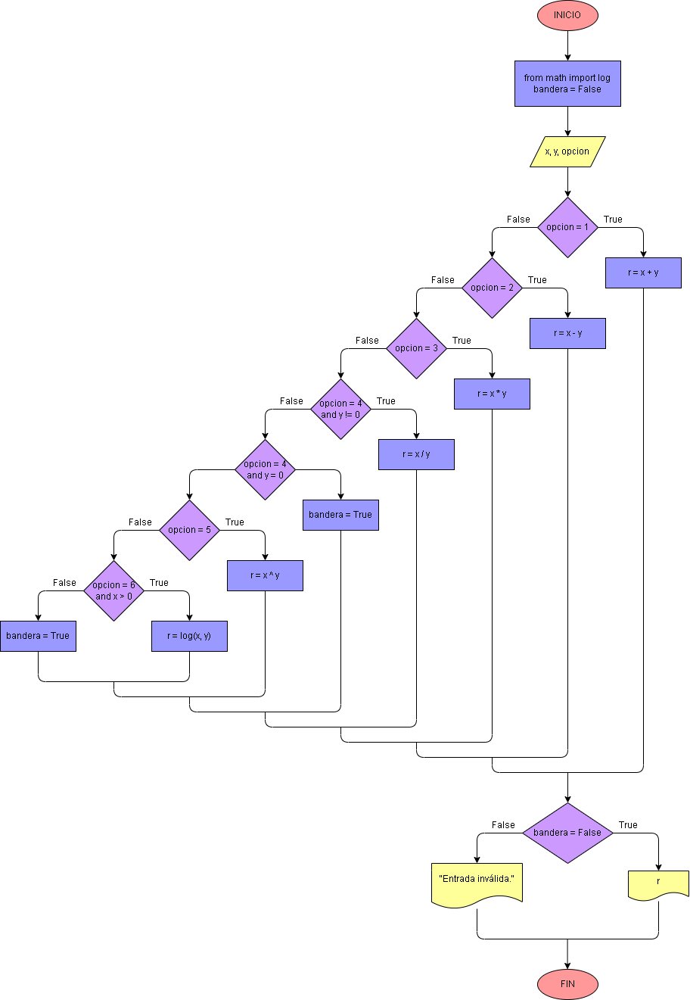

# Ejercicio No. 17: Calculadora básica con menú.

Una calculadora básica se puede realizar con condiciones.  Se desea realizar algunas de las operaciones básicas con dos números x y y.  Además, se desea calcular la potencia y el logaritmo. Se deben de considerar los casos donde y=0, donde la división x÷y no se puede realizar y cuando x≤0 donde no se puede calcular el log⁡(x). Se desea generar un menú para que el usuario pueda seleccionar la operación a realizar. Una manera de hacerlo es la siguiente:

1.	Se reciben los dos números ‘x’ y ‘y’ para realizar la operación.
2.	Se recibe la operación a realizar mediante la variable ‘opcion’ la que selecciona en el menú qué operación ejecuta el algoritmo.
3.	Se inicializa la variable lógica ‘bandera = False’.  Si la división o el logaritmo no se pueden calcular, se hace ‘bandera = True’.
4.	Mediante condiciones se realiza la operación deseada.
    * En el caso de la división, si ‘y = 0’, NO se puede realizar la división, se hace ‘bandera = True’ y se muestra un mensaje.
    * En el caso del logaritmo, si ‘x <= 0’, NO se puede calcular el logaritmo, se hace ‘bandera = True’ y se muestra un mensaje.
5.	Se muestra el resultado en el caso de que ‘bandera = False’.

