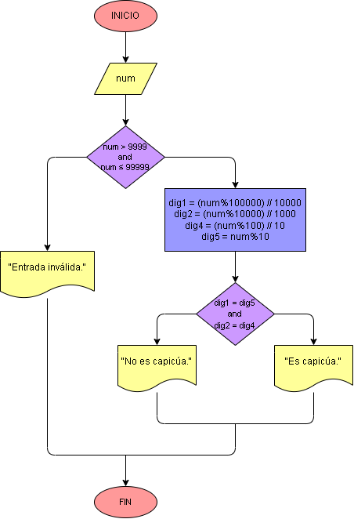

# Ejercicio No. 18: Número capicúa.

El primer paso es comprobar que el número ingresado sea de 5 dígitos, y si esto es cierto, al utilizar el residuo en conjunto con la división entera, obtenemos el dígito que queramos del número. El resto del programa depende de comparar si el primer dígito es igual al último y el segundo al penúltimo. La entrada es la variable num ingresada por el usuario, y la salida se determina por las comparaciones, pudiendo ser positiva o negativa.

