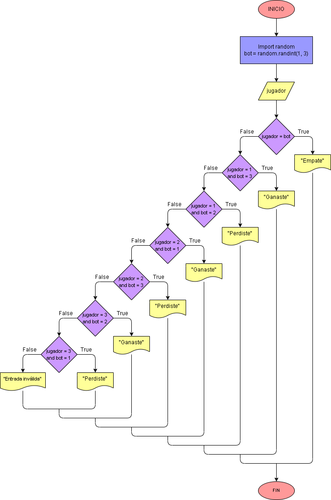

# Piedra, papel o tijeras

Para este proyecto se va a implementar la librería random y el método randint para que la máquina escoja un número del 1 al 3, los cuales representarán piedra, papel o tijera, respectivamente. El usuario escogerá su opción en base a números y estos serán comparados para que se puedan dar los posibles escenarios de victoria, derrota, empate u otro mensaje en caso de que la entrada sea diferente a las opciones disponibles.

