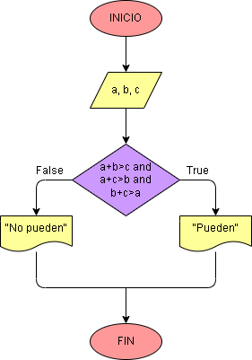

# Ejercicio No. 20: ¿Puede formar un triángulo?

"La suma de las longitudes de cualesquiera dos lados de un triángulo es mayor que la longitud del tercer lado."
Utilizando el anterior teorema, determinamos si a, b y c pueden construir un triángulo.

