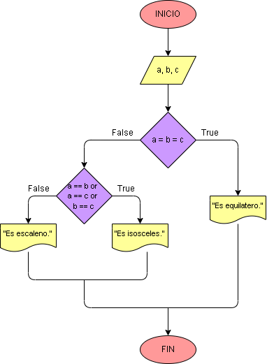

# Ejercicio No. 21: Triángulo equilátero, isósceles o escaleno.

Las variables son los lados a, b y c, ingresados por el usuario. Luego, utilizamos las condiciones para determinar en qué clasificación entrará en triángulo que se forme.
Clasificación de los triángulos por sus lados:

* Equilátero: Todos sus lados son iguales.
* Isósceles: Dos de sus tres lados son de igual longitud.
* Escaleno: Todos sus lados son de diferente longitud.

