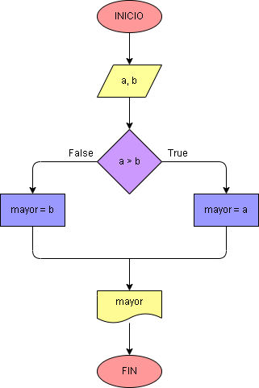

# Ejercicio No. 6: Mayor entre dos números.

El programa por crear le pedirá al usuario el ingreso de dos números que se almacenarán en las variables a y b, seguido de esto se utilizará el condicional if y un operador de comparación, por último, se imprimirá cuál de los dos números es el mayor.

Ejemplo de operador de comparación:  a > b

