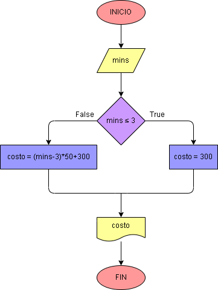

# Ejercicio No. 7: Costo de llamada telefónica

Primero se pedirá al usuario que ingrese el tiempo que duró su llamada en minutos y para calcular el costo se usará el condicional if, dando la condición de que si es menor o igual ( <= ) a 3 minutos, el costo de esa llamada habrá sido de $300 pesos, mientras que si no se cumple tendremos que sumarle $50 pesos por cada minuto que transcurra. Al final del programa se imprimirá en pantalla el valor que debe cancelar el usuario.

