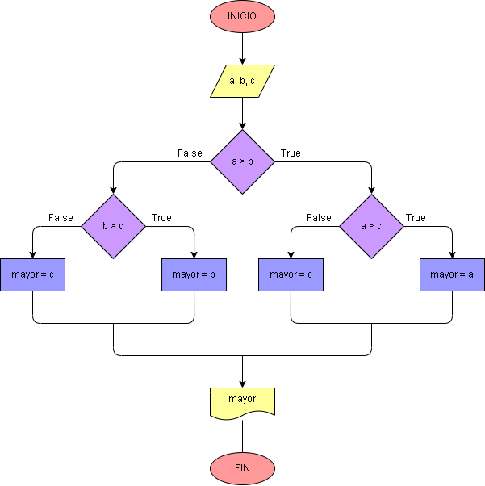

# Ejercicio No. 8: Número mayor entre tres números

Para la realización de este programa se debe tener claro cómo se ubican los números enteros en una recta, la cual nos dice que los números enteros están organizados de forma creciente si se observa de izquierda a derecha, teniendo este concepto claro, se procede a usar el condicional con los operadores relacionales para que se compare cual es el mayor de los tres.

