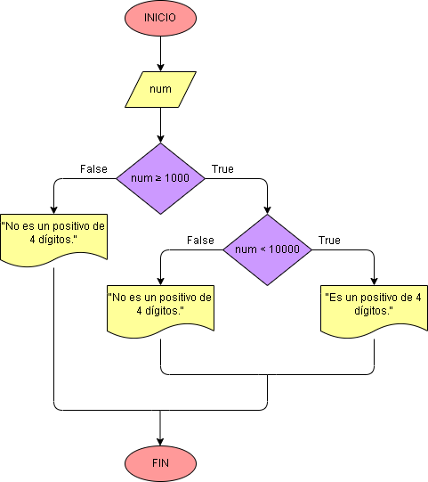

# Ejercicio No. 9: ¿Es un positivo de 4 dígitos?

Para responder esta pregunta, se utilizan condiciones dentro de condiciones, es decir, si el número ingresado es mayor o igual a 1000, o, en otras palabras, si llega a ser True, se evalúa otro condicional para determinar que el número no sea mayor de cuatro dígitos, es decir, menor que 10000. Ya teniendo esta estructura se podrán dar más respuestas en las cuales dos serán negativas y solo una podrá ser la que nos pide el problema.

